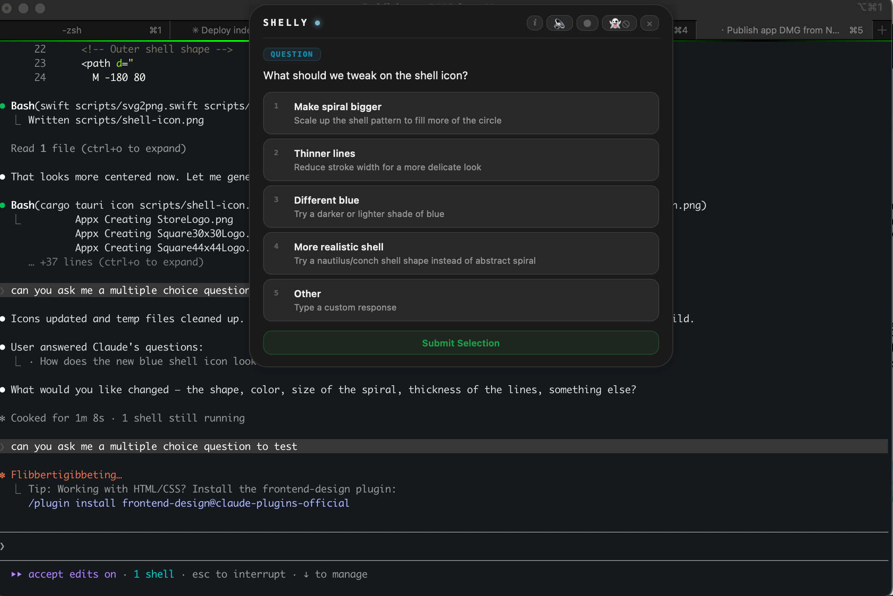

# Shelly

**Stay in flow while your agents keep working.** Monitor, approve, and respond — right from a floating overlay.

Shelly is a native macOS app that gives you a beautiful glass-style control surface for AI coding agents. It intercepts permission requests, multi-choice questions, and notifications so you never have to switch to the terminal.

Built with Tauri 2 and Rust. Under 15MB, minimal RAM, instant startup.

<p align="center">
  
</p>

---

## Features

### Multi-Choice Question Answering
When Claude Code asks you a question, Shelly intercepts it and shows the actual options as clickable buttons. Select by clicking or pressing number keys (1-9). Your answer goes back directly — the question never appears in the terminal.

### Permission Approvals
Three-button permission dialog:
- **Yes** (`⌘Y`) — allow this once
- **Always** — allow and never ask again for this tool
- **No** (`⌘N`) — deny

### Ghost Mode
Toggle the 👻 button to enable ghost mode. The window hides after you respond and only pops back when there's something new. Includes animated feedback overlays showing ✔ ALLOWED, ✘ DENIED, or ✔ ANSWERED before fading away.

### Three Themes
- **Liquid Glass** — frosted translucent blur with shimmer animation, specular highlights, and chromatic edge dispersion
- **White** — clean solid white
- **Dark** — solid dark background

### 8-Bit Sound Alerts
Synthesized sound effects for notifications, permissions, questions, completions, and allow/deny responses. Mute with one click.

### Event Queue
Multiple incoming events are queued and shown one at a time. A badge shows how many are pending.

### Auto-Update
Checks for updates on launch and installs them automatically. No manual downloads needed after initial install.

### Zero Configuration
Hooks are auto-installed on launch and cleanly removed on quit. No manual setup.

### Privacy First
Server listens on `127.0.0.1` only. No data leaves your machine.

---

## Installation

### Prerequisites
- macOS (Apple Silicon or Intel)
- Rust toolchain (`rustup`)
- Tauri CLI (`cargo install tauri-cli`)
- Node.js 18+

### From Source

```bash
git clone <repo-url> shelly
cd shelly
npm install
cargo tauri dev      # Development
cargo tauri build    # Production (.dmg)
```

### From DMG
Download the latest `.dmg` from [Releases](https://github.com/aiwhiteteam/shelly/releases), open it, and drag Shelly to Applications.

> [**Download Shelly (macOS Apple Silicon)**](https://github.com/aiwhiteteam/shelly/releases/download/v1.0.0/Shelly_1.0.0_aarch64.dmg)

---

## How It Works

1. Shelly creates a frameless overlay at the top of your screen and starts an HTTP server on port 21517
2. Hooks are installed in `~/.claude/settings.json` so Claude Code sends events to Shelly
3. `PreToolUse` hook intercepts `AskUserQuestion` — shows multi-choice UI, sends answer back via `updatedInput`
4. `PermissionRequest` hook shows Yes/Always/No for tool approvals
5. Events queue up and show one at a time
6. On quit, hooks are removed

---

## Architecture

```
┌─────────────────────────────────────┐
│         Shelly UI (WebView)         │
│  SHELLY ●  [i] [🔈] [◇] [👻] [✕]  │
│  ─────────────────────────────────  │
│  Which framework?                   │
│  [1] React  [2] Vue  [3] Angular   │
└──────────────┬──────────────────────┘
               │ Tauri IPC
┌──────────────┴──────────────────────┐
│     Rust Backend (Tauri + Axum)     │
│  POST /hooks/pre-tool-use           │
│  POST /hooks/permission             │
│  POST /hooks/notification           │
│  POST /hooks/stop                   │
│  POST /hooks/auto-allow             │
└──────────────┬──────────────────────┘
               │ HTTP hooks
┌──────────────┴──────────────────────┐
│       Claude Code / AI Agents       │
└─────────────────────────────────────┘
```

---

## Keyboard Shortcuts

| Shortcut | Action |
|----------|--------|
| `⌘Y` | Allow permission |
| `⌘N` | Deny permission |
| `1`–`9` | Select question option |

---

## Publishing Updates

```bash
# One-time: generate signing keys
cargo tauri signer generate --password "your-password" -w ~/.tauri-keys/shelly.key

# Set env vars
export TAURI_SIGNING_PRIVATE_KEY=$(cat ~/.tauri-keys/shelly.key)
export TAURI_SIGNING_PRIVATE_KEY_PASSWORD="your-password"

# Publish a new version
./scripts/publish.sh 1.1.0
```

See `scripts/publish.sh` for the full workflow (build, sign, GitHub release, update manifest).

---

## Development

```bash
npm run build:frontend    # Build TS + copy HTML/CSS
cargo tauri dev           # Run with hot reload
cargo tauri build         # Production build
```

### Project Structure

```
src-tauri/src/
├── main.rs           # Entry point
├── lib.rs            # Tauri setup, IPC commands, plugins
├── server.rs         # Axum HTTP server
├── hooks.rs          # Hook install/uninstall/allow-always
└── sessions.rs       # Agent process detection

src/renderer/
├── index.html        # UI markup
├── styles.css        # Themes + animations
└── renderer.ts       # All frontend logic
```

---

## License

MIT
